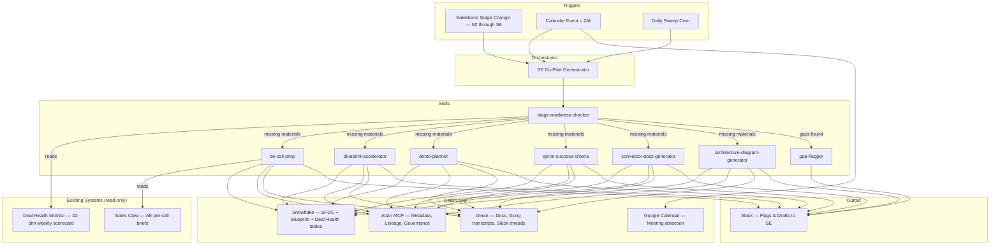
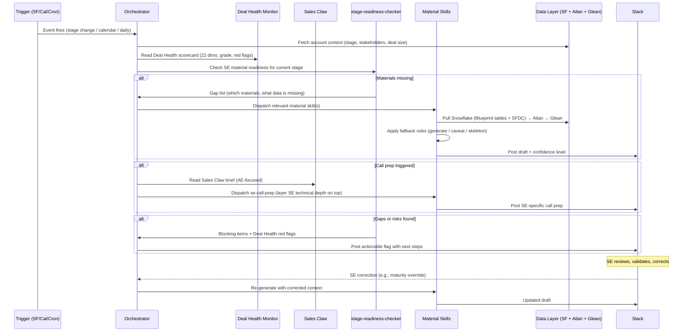

# SE Co-Pilot — Architecture

## Skill Graph

## Execution Flow

## Sales Stages (S2–S6)

| Stage | Name | SE-Owned Materials Required |
|-------|------|----------------------------|
| **S2** | Why Change? | Account research, initial call prep, persona mapping |
| **S3** | Why Now? | Business case alignment, user interviews (3+ before POV), Blueprint started, people readiness |
| **S4** | Why Atlan? | Blueprint tech tab complete, tailored demo, competitive positioning, POV success criteria, whiteboarding |
| **S5** | Selection | Production architecture diagram (signed off), connector docs, sprint success criteria, internal knowledge transfer |
| **S6** | Contract | Final documentation package, handoff materials for CX/IE |

## Architecture Decisions

### Pattern: Event-driven single orchestrator with skill dispatch

**Why:** Three discrete triggers (stage change, calendar, cron) each dispatch to the same set of material-generation skills. A single orchestrator with skill dispatch keeps routing logic in one place while skills stay independently testable.

**Key design choice: compose with existing systems, don't replace them.**
- **Deal Health Monitor** already scores 22 dimensions weekly per deal in Snowflake Cortex. The stage-readiness-checker reads these scores and layers SE-specific material readiness on top — it does not rebuild deal assessment from scratch.
- **Sales Claw** already generates AE-focused pre-call briefs (account snapshot, Gong summary, discovery questions). The se-call-prep skill reads the Sales Claw brief and adds SE technical depth: Blueprint status, connector gaps, architecture readiness, persona-specific technical talking points. SEs get a brief that builds on what the AE sees, not a separate one.

**Rejected alternatives:**
- **Multi-agent pipeline** — overkill. Materials are independent (call prep doesn't block architecture diagrams). No sequential dependency justifies chaining agents.
- **Pure ReAct loop** — decisions are deterministic (stage → required materials → generate), not exploratory.
- **Rebuilding Deal Health / Sales Claw** — wasteful. Both exist and work. The agent's unique value is material generation and SE-specific gap-flagging, not deal scoring or generic call prep.

### Runtime: Claude Agent SDK + Claude Sonnet

- **Claude Agent SDK** — native tool use, structured output. The orchestrator calls MCP servers (Snowflake, Atlan, Slack) and produces structured materials.
- **Claude Sonnet** — balances cost and capability for structured writing. Architecture diagrams use stricter validation prompts; upgrade path to Opus for that single skill if quality is insufficient.

### Data access: MCP servers + Snowflake tables

| Source | What it provides | Access method |
|--------|-----------------|---------------|
| **Snowflake** | SFDC mirror (opps, accounts, contacts, activities, stage history), Blueprint tables (`BLUEPRINT.EXTRACTOR.TECH_ITEMS`, `BLUEPRINT.EXTRACTOR.SUCCESS_CRITERIA`), Deal Health scores (`SALES_DB.PIPELINE.DEAL_HEALTH_MONITORING`) | Snowflake MCP, read-only |
| **Atlan** | Customer tenant metadata, lineage, glossary, governance tags, connector inventory | Atlan MCP — **BLOCKED: `home.atlan.com` credentials needed** |
| **Glean** | Gong transcripts, Confluence docs, Slack threads, internal knowledge | Glean MCP (search + chat) |
| **Slack** | Post drafts/flags, receive SE corrections | Slack MCP (chat:write, reactions) |
| **Google Calendar** | Meeting detection for call prep triggers | Calendar MCP, read-only |

Blueprint is no longer a separate Confluence integration — its structured data already flows into Snowflake as `BLUEPRINT.EXTRACTOR.*` tables. The agent reads Blueprint through Snowflake, not Confluence.

### Memory model

**Session state per account** stored in Snowflake (or local SQLite for v1):
- Last material generation timestamps per material type
- SE corrections (maturity overrides, manual gap closures)
- Data freshness timestamps per source
- Material draft versions and SE feedback

No long-term conversational memory. The agent is stateless between runs — it reads fresh context from data sources each trigger.

### Staleness handling

| Source | Threshold | Behavior |
|--------|-----------|----------|
| Salesforce → Snowflake | 12h | Generate with timestamp warning |
| Deal Health Monitor | 7 days (runs weekly Sunday) | Note which week's scores are shown |
| Atlan metadata | 24h (general), 48h (arch diagrams in prod planning) | Generate with staleness flag |
| Blueprint → Snowflake | Real-time (extractor) | Always read latest |

### Output surface

**V1: Slack only.** Drafts and flags posted to SE's DM or dedicated channel. Structured messages with:
- Account name + stage + Deal Health grade (Green/Yellow/Red)
- Material type + confidence level (high / caveated / skeleton)
- Specific gaps with suggested next steps
- Data freshness warnings if applicable

**V2: Dashboard** (Slack canvas or lightweight web view) — all accounts, stage, material readiness %, Deal Health grade, top blockers.
